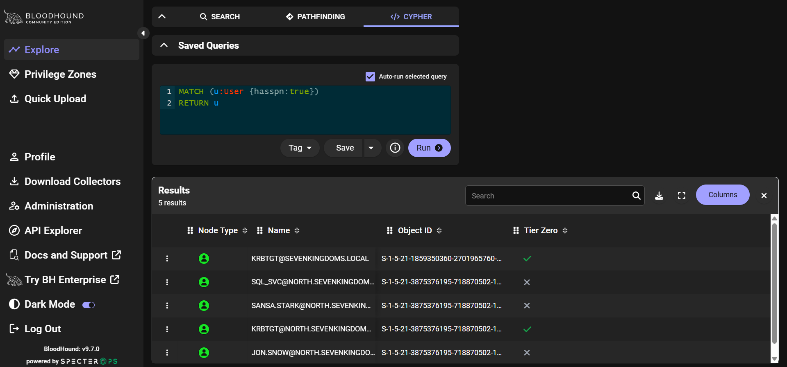
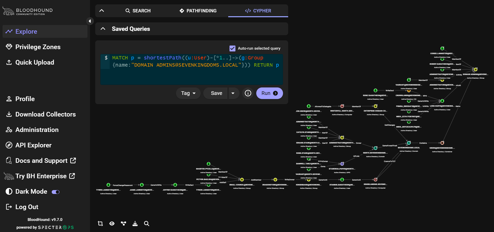
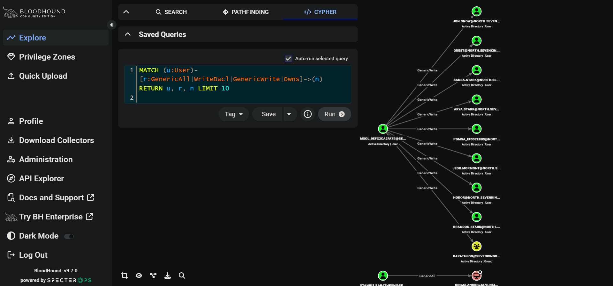
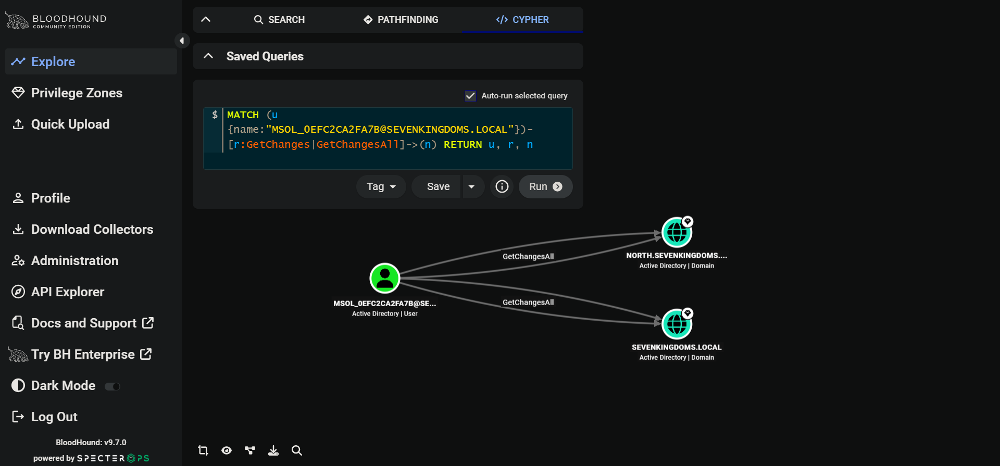
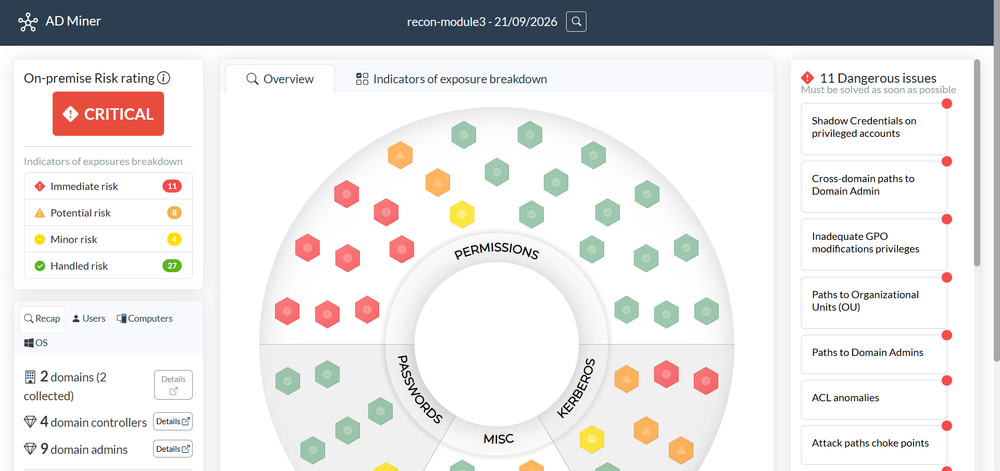
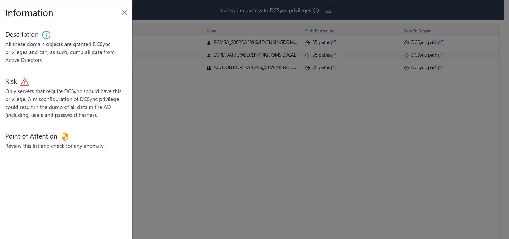
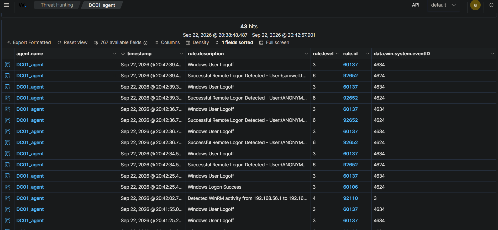
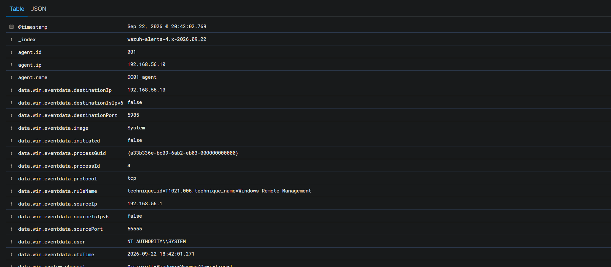

# Module 3 — Reconnaissance moderne

## Cible

Scope réseau `192.168.56.0/24` (VMnet2). Quatre machines AD dans le scope : `192.168.56.10` (KINGSLANDING, DC racine `sevenkingdoms.local`), `192.168.56.11` (WINTERFELL, DC enfant `north.sevenkingdoms.local`), `192.168.56.22` (CASTELBLACK, serveur membre NORTH), `192.168.56.30` (DC03, DC additionnel de `sevenkingdoms.local`, Windows Server 2025 non patché — voir module 6). `192.168.56.40` (wazuh-manager) apparaît dans les scans réseau mais n'est pas une cible, c'est le SIEM.

Poste attaquant : WSL2 (Debian), pas de VM Kali dédiée — voir README, section architecture.

---

## 1. Découverte réseau

```bash
nmap -sn 192.168.56.0/24
```
Ping sweep simple : identifie les hôtes actifs sur le segment avant d'aller plus loin. Résultat : 5 hôtes actifs (`.10`, `.11`, `.22`, `.30`, `.40`).

```bash
nmap -p- --min-rate 2000 192.168.56.10 192.168.56.11 192.168.56.22 192.168.56.30 192.168.56.40
```
Scan complet des 65535 ports TCP sur les 5 hôtes (`--min-rate 2000` pour accélérer le balayage sans saturer la pile réseau virtuelle — un premier essai à `--min-rate 5000` avait généré des pertes de paquets et des ports classés `filtered` par erreur).

**Résultat :**

| Hôte | Ports AD (88, 389, 464, 3268/69, 9389) | Autres ports notables |
|---|---|---|
| KINGSLANDING (.10) | Présents | 3389 (RDP), 5985/5986 (WinRM), 80 |
| WINTERFELL (.11) | Présents | 3389, 5985/5986 |
| CASTELBLACK (.22) | Absents | 445 (SMB), 1433 (MSSQL), 5985/5986 — confirme le rôle de serveur membre, pas DC |
| DC03 (.30) | Présents | 5985 seul (pas de 5986, **pas de 3389/RDP**) |
| wazuh-manager (.40) | — | 22 (SSH), 443 (HTTPS) uniquement — confirme que ce n'est pas une cible AD |

L'absence de RDP sur DC03 est une différence de configuration par rapport aux autres DC (VM reconstruite manuellement via Packer/GOAD plutôt que provisionnée à l'identique — voir `infra/README.md`), pas une anomalie de sécurité en soi.

---

## 2. Énumération anonyme (NetExec)

```bash
nxc smb 192.168.56.10 192.168.56.11 192.168.56.22 192.168.56.30
```
Fingerprinting SMB de base sans authentification : OS, nom de domaine, signing SMB, `Null Auth`. Résultat : `Null Auth:True` sur les 3 DC (KINGSLANDING, WINTERFELL, DC03) ; CASTELBLACK n'a pas cette info (pas DC).

```bash
nxc smb 192.168.56.10 192.168.56.11 192.168.56.22 192.168.56.30 -u '' -p '' --users
```
Tente une énumération SAMR anonyme des comptes. **Résultat asymétrique et intéressant** : la session anonyme s'établit (`[+]`) sur les 3 DC, mais **seule WINTERFELL liste réellement ses utilisateurs** (10 comptes du domaine NORTH) — KINGSLANDING et DC03 acceptent la session mais ne renvoient aucune liste. Hypothèse à documenter, non confirmée : une policy `RestrictAnonymous`/`RestrictAnonymousSAM` différente entre le domaine racine (`sevenkingdoms.local`) et le domaine enfant (`north.sevenkingdoms.local`). CASTELBLACK refuse (`STATUS_ACCESS_DENIED`), cohérent avec son rôle de serveur membre.

**Finding critique** : mot de passe en clair dans la description LDAP d'un compte, visible dans la sortie ci-dessus :
```
samwell.tarly    Samwell Tarly (Password : Heartsbane)
```

---

## 3. Validation du credential trouvé

```bash
nxc smb 192.168.56.10 192.168.56.11 192.168.56.22 192.168.56.30 -u 'samwell.tarly' -p 'Heartsbane' -d north.sevenkingdoms.local
```
Vérifie que le credential trouvé fonctionne sur l'ensemble du scope. **Résultat : authentification réussie sur les 4 machines**, y compris DC03 et CASTELBLACK — confirme un trust bidirectionnel/transitif entre `sevenkingdoms.local` et `north.sevenkingdoms.local`, sur un troisième DC (DC03) en plus de KINGSLANDING.

---

## 4. Cartographie LDAP de la forêt

```bash
ldapsearch -x -H ldap://192.168.56.10 \
  -D 'samwell.tarly@north.sevenkingdoms.local' -w 'Heartsbane' \
  -b "CN=Partitions,CN=Configuration,DC=sevenkingdoms,DC=local" \
  "(&(objectClass=crossRef)(systemFlags=3))" dnsRoot
```
Interroge la partition Configuration (répliquée sur tous les DC de la forêt, quel que soit leur domaine) pour lister les domaines existants. `-x` = bind simple (login/mot de passe en clair) ; `-D`/`-w` = identifiants ; `-b` = base de recherche ; le filtre cible les objets `crossRef` marqués comme domaines (`systemFlags=3`). Résultat : confirme les 2 domaines de la forêt, `sevenkingdoms.local` et `north.sevenkingdoms.local`.

**Même requête tentée contre DC03** (`ldap://192.168.56.30`) : échoue avec *"Strong(er) authentication required"*. **Finding de durcissement** : contrairement à KINGSLANDING (Server 2019), DC03 (Server 2025) refuse le bind LDAP simple non chiffré — il exige un canal signé/chiffré avant d'accepter des identifiants. Tentative en LDAPS (`ldaps://`, port 636) échoue à son tour, cette fois côté client (*"Can't contact LDAP server"*) car le certificat TLS auto-signé de DC03 n'est pas reconnu. Contournement :
```bash
LDAPTLS_REQCERT=never ldapsearch -x -H ldaps://192.168.56.30 \
  -D 'samwell.tarly@north.sevenkingdoms.local' -w 'Heartsbane' \
  -b "CN=Partitions,CN=Configuration,DC=sevenkingdoms,DC=local" \
  "(&(objectClass=crossRef)(systemFlags=3))" dnsRoot
```
`LDAPTLS_REQCERT=never` dit à la bibliothèque TLS d'accepter le certificat sans vérification — acceptable en lab sur un certificat qu'on sait être le sien, jamais en production (ça désactiverait une protection anti-MITM). Résultat : même sortie que sur KINGSLANDING, confirme que la réplication de la partition Configuration fonctionne normalement malgré la différence de posture de sécurité entre les deux DC.

---

## 5. Collecte BloodHound

```bash
bloodhound-ce-python -u 'samwell.tarly@north.sevenkingdoms.local' -p 'Heartsbane' \
  -d sevenkingdoms.local -ns 192.168.56.30 -c All

bloodhound-ce-python -u 'samwell.tarly@north.sevenkingdoms.local' -p 'Heartsbane' \
  -d north.sevenkingdoms.local -ns 192.168.56.30 -c All
```
`-ns` désigne le serveur DNS utilisé pour résoudre le DC réel à contacter, pas directement le DC interrogé — dans les deux cas, l'outil a en réalité contacté KINGSLANDING puis WINTERFELL (visible dans les logs `Connecting to LDAP server: ...`), pas DC03 lui-même. `-c All` collecte toutes les catégories (users, groups, ACLs, sessions, trusts...). Un `WARNING: Failed to get Kerberos TGT` apparaît (résolution DNS de `winterfell.north.sevenkingdoms.local` échoue pour Kerberos) — l'outil bascule proprement sur NTLM, la collecte aboutit quand même.

**Croissance de la forêt constatée** par rapport à une collecte antérieure : `sevenkingdoms.local` compte maintenant 4 computers (DC03, CONNECTOR, vagrant-2025, kingslanding) contre 1 auparavant, et 19 users contre 16.

Les 14 fichiers JSON générés sont importés dans BloodHound CE via **Quick Upload** (interface web, `http://localhost:8080`). Le conteneur Docker (BloodHound CE + Neo4j + Postgres) doit tourner pour l'import et l'exploration, mais pas pour la collecte elle-même (`bloodhound-ce-python` s'exécute indépendamment).

---

## 6. Requêtes Cypher personnalisées

Requêtes écrites à la main dans l'onglet **Cypher** de BloodHound CE, sauvegardées dans `agent/queries/`.

### 6.1 Comptes kerberoastables

```cypher
MATCH (u:User {hasspn:true}) RETURN u
```
Cherche tous les comptes avec un SPN défini (condition du Kerberoasting). Résultat : 5 comptes, dont **KRBTGT@sevenkingdoms.local** et **KRBTGT@north.sevenkingdoms.local** (à exclure — mot de passe non cassable en pratique), et 3 cibles réelles : `sql_svc@north.sevenkingdoms.local` (compte de service, cible classique), `sansa.stark` et `jon.snow` (comptes utilisateurs avec SPN, configuration inhabituelle qui les rend candidats aussi).



### 6.2 Chemins vers Domain Admins

```cypher
MATCH p = shortestPath((u:User)-[*1..]->(g:Group {name:"DOMAIN ADMINS@SEVENKINGDOMS.LOCAL"})) RETURN p
```
`[*1..]` accepte une chaîne de relations de longueur variable, de tout type (`MemberOf`, ACL, sessions...), pour révéler des chemins indirects. Résultat notable : une chaîne longue via plusieurs comptes Lannister (`ForceChangePassword` → `GenericWrite` → `WriteDacl` → `AddSelf` → `AddMember` → `WriteOwner`, jusqu'à l'objet ordinateur KINGSLANDING), et un abus cross-domain — un compte administrateur du domaine **enfant** (NORTH) dispose d'un droit `GenericAll` sur le groupe Administrators du domaine **racine**, qui lui-même contrôle Domain Admins.



### 6.3 ACL dangereuses générales

```cypher
MATCH (u:User)-[r:GenericAll|WriteDacl|GenericWrite|Owns]->(n) RETURN u, r, n LIMIT 10
```
`GenericAll` = contrôle total (y compris modification de l'ACL elle-même) ; `WriteDacl` = droit de modifier l'ACL, donc de s'accorder n'importe quel autre droit ensuite ; `GenericWrite` = écriture sur la plupart des attributs, mais pas sur l'ACL ; `Owns` = propriétaire de l'objet, avec les mêmes implications que WriteDacl.

**Finding majeur** : le compte **`MSOL_0EFC2CA2FA7B@SEVENKINGDOMS.LOCAL`** — nommage caractéristique d'un compte de service Microsoft Entra Connect — a `GenericWrite` sur une dizaine de comptes du domaine NORTH et surtout `GenericAll` sur **KINGSLANDING elle-même** (le DC racine).



Vérification ciblée :
```cypher
MATCH (u {name:"MSOL_0EFC2CA2FA7B@SEVENKINGDOMS.LOCAL"})-[r:GetChanges|GetChangesAll]->(n) RETURN u, r, n
```
Confirme que ce compte a **`GetChangesAll`** sur les deux domaines de la forêt — la combinaison de droits qui permet un DCSync complet (extraction de tous les hashs, y compris `krbtgt`). C'est le pivot on-prem ↔ cloud décrit au module 8, confirmé concrètement dans ce lab.



---

## 7. AD Miner

Bibliothèque de 160 requêtes Cypher pré-écrites, exécutées automatiquement contre la même base Neo4j, agrégées dans un rapport HTML statique.

**Installation :**
```bash
sudo apt install pipx -y
pipx ensurepath
pipx install 'git+https://github.com/Mazars-Tech/AD_Miner.git'
```

**Exécution** (connexion directe à Neo4j, pas aux identifiants du compte web BloodHound — ce sont deux systèmes d'authentification séparés) :
```bash
AD-miner -c -cf recon-ad-miner-report -u neo4j -p bloodhoundcommunityedition
```
Génère un dossier `recon-ad-miner-report/` contenant `index.html` (point d'entrée), un fichier `data_*.json` (toutes les données), et les dossiers `css/`, `js/`, `icons/`, `assets/` — l'ensemble doit être conservé tel quel dans le repo, pas seulement `index.html` et le JSON, sinon le rapport perd sa mise en forme et ses graphes interactifs.

**Résultats clés :**
- Score de risque global : **CRITICAL** (11 risques immédiats, 8 potentiels, 4 mineurs, 27 déjà couverts).



- Page `can_dcsync.html` : 3 objets avec droits DCSync jugés **anormaux** par AD Miner — `PGMSA_2002DAF3$` (gMSA), `LORD.VARYS` (compte utilisateur classique, le plus alarmant des trois), `ACCOUNT OPERATORS` (un groupe entier). Distinct du compte `MSOL_` trouvé manuellement en 6.3 : AD Miner le classe à part comme compte Entra Connect légitime (`is_msol=TRUE`), pas comme anomalie — les deux findings se complètent, ne se recoupent pas.



- 3 comptes kerberoastables confirmés (cohérent avec 6.1).
- 1 compte **AS-REP Roastable** détecté — non trouvé manuellement, une piste supplémentaire pour le module 5 (pré-authentification Kerberos désactivée sur ce compte).
- Niveau fonctionnel de la forêt jugé insuffisant selon l'échelle ANSSI.

---

## 8. Vérification côté Wazuh

### 8.1 Premier essai — chaîne de supervision interrompue

Au moment de la reconnaissance initiale (21 septembre, ~22h), recherche de traces dans **Threat Hunting** (`agent.name:DC01_agent`, EventID Sysmon 3, EventID Security 4624/4625/4768/4769) : **aucun résultat**, sur DC01 comme sur les autres agents.

Diagnostic via le journal interne de l'agent (`ossec.log` — à ne pas confondre avec les logs Sysmon/Windows eux-mêmes : ce fichier ne contient que les métadonnées de fonctionnement de l'agent, jamais les événements qu'il collecte) :
```powershell
Get-Content "C:\Program Files (x86)\ossec-agent\ossec.log" -Tail 100
```
Révèle un échec de connexion au manager à 15h21 (*"target machine actively refused it"*, port 1514), suivi d'un **trou total de plus de 19 heures** sans aucune tentative de reconnexion, jusqu'à un redémarrage complet de l'agent (nouveau PID) le lendemain à 10h35. **Conclusion : au moment exact de la reconnaissance, l'agent Wazuh de DC01 n'était très probablement pas actif** (VM ou service arrêté) — la fenêtre de recon a coïncidé avec une interruption de la chaîne de supervision.

**Constat à retenir, au-delà du cas précis** : une télémétrie n'a de valeur que si elle est continue. Un trou de collecte, même de quelques heures, peut masquer entièrement une activité malveillante — un point souvent négligé en environnement réel, où la disponibilité du SIEM lui-même est rarement monitorée avec autant de rigueur que les logs qu'il collecte.

### 8.2 Second essai — reconnaissance rejouée avec supervision active

Toutes les commandes des sections 1 à 3 relancées à l'identique, après confirmation que `wazuh-manager` et l'agent DC01 étaient bien connectés. Recherche dans Threat Hunting sur une fenêtre de 4 minutes : **43 hits**, dont plusieurs findings directement exploitables :



- **Règle 92652** *"Successful Remote Logon Detected... NTLM authentication, possible pass-the-hash attack"* déclenchée pour **`ANONYMOUS LOGON`** (trace de l'énumération SAMR anonyme, section 2) et pour **`samwell.tarly`** (trace de l'authentification NTLM, section 3). Point à noter : cette règle se déclenche sur toute authentification NTLM jugée à risque, y compris un mot de passe classique légitime — pas seulement un vrai pass-the-hash avec un hash volé. C'est un faux positif de nommage à expliquer, pas une fausse détection au sens propre.
- **Règle 92110** *"Detected WinRM activity"* (EventID Sysmon 3), avec `sourceIp: 192.168.56.1` (l'adresse hôte-only que la machine hôte/WSL2 utilise pour sortir vers VMnet2) et `rule.mitre.id: T1021.006` (Windows Remote Management, tactique Lateral Movement) — capté automatiquement par la config Olaf Hartong.
- Rafale de `Windows Logon Success` / `Windows User Logoff` (EventID 4624/4634) et de tickets Kerberos (EventID 4769), cohérente avec le volume de connexions SMB générées par NetExec sur plusieurs comptes/domaines.



**Limite technique importante à documenter** : le détail complet d'un événement EventID 3 (`data.win.eventdata.image: System`, pas de ligne de commande) montre que Sysmon ne capture **jamais** de commande CLI pour un simple événement réseau — cette information n'existe que pour l'EventID 1 (Process Create), qui nécessite qu'un processus démarre réellement **sur la machine surveillée**. Une énumération SMB/LDAP à distance (NetExec, ldapsearch) reste par nature `network-only` : visible comme connexion, jamais comme commande attribuable à un outil précis, tant qu'aucune exécution locale n'a lieu sur la cible.

---

### 8.3 Triage des alertes

Pour chaque type d'alerte remonté lors de la reconnaissance rejouée (§8.2), triage effectué comme le ferait un analyste L1 découvrant ces alertes sans connaître à l'avance qu'il s'agit d'un test contrôlé — en appliquant le cadre des **5W** (Who, What, When, Where, Why) avant de trancher.

---

#### Alerte 1 — Règle `92652`, `ANONYMOUS LOGON`

- **Who (qui)** : session anonyme (`ANONYMOUS LOGON`), aucune identité authentifiée réelle.
- **What (quoi)** : connexion SMB réussie sans identifiants, suivie d'une énumération SAMR des comptes locaux/domaine.
- **When (quand)** : 22 septembre, 20:42, en rafale sur quelques secondes — cohérent avec un outil automatisé, pas une frappe humaine.
- **Where (où)** : cible KINGSLANDING/DC01 (192.168.56.10), source `192.168.56.1` (interface hôte-only VMnet2).
- **Why (pourquoi, côté attaquant présumé)** : reconnaissance active — collecter la liste des comptes du domaine sans avoir besoin d'identifiants au préalable, première étape classique avant de cibler un compte précis.

**Verdict** : **Vrai positif.** Une énumération anonyme réussie n'est jamais un comportement légitime en usage normal — même un outil d'administration interne s'authentifie.

**Pourquoi une escalade** : un `ANONYMOUS LOGON` suivi d'énumération est une signature de reconnaissance pré-attaque documentée (T1087 — Account Discovery) ; si elle passe inaperçue, l'attaquant obtient gratuitement la liste des cibles pour l'étape suivante (brute-force, password spraying). Le coût de l'ignorer est disproportionné par rapport au coût de vérifier.

**Action immédiate** : investiguer l'IP source (`192.168.56.1`), confirmer s'il s'agit d'un hôte légitime du réseau ou d'un point d'entrée externe ; vérifier si d'autres tentatives de connexion (authentifiées cette fois) suivent dans les minutes suivantes depuis la même source.

**Recommandation (remédiation)** : désactiver l'énumération SAMR anonyme sur les DC concernés si aucun usage métier ne la justifie (clé de registre `RestrictAnonymous`/`RestrictAnonymousSAM`) — corrige la cause, pas seulement le symptôme.

---

#### Alerte 2 — Règle `92652`, `samwell.tarly` (NTLM)

- **Who** : `samwell.tarly`, compte de domaine valide (`north.sevenkingdoms.local`).
- **What** : authentification NTLM réussie, classée par la règle comme "possible pass-the-hash attack".
- **When** : 22 septembre, 20:42, juste après l'alerte 1 — cohérent avec un enchaînement outil de recon → authentification avec un credential fraîchement trouvé.
- **Where** : cible KINGSLANDING/DC01, même source `192.168.56.1`.
- **Why** : authentification légitime avec un mot de passe connu (`Heartsbane`), pas un hash rejoué — mais la règle Wazuh ne peut pas faire cette distinction à partir du seul protocole NTLM utilisé.

**Verdict** : **Faux positif de nommage**, pas une fausse alerte au sens strict. Le signal capté (NTLM plutôt que Kerberos) est réel et mérite d'être noté, mais le libellé "pass-the-hash" présume une technique qui n'a pas été utilisée ici.

**Pourquoi pas d'escalade** : aucune preuve d'un hash volé/rejoué (pas d'`Overpass-the-Hash`, pas de `mimikatz` détecté en amont sur une autre machine) — le contexte (recon puis authentification avec le même compte trouvé en clair) explique entièrement l'événement sans hypothèse aggravante.

**Action immédiate** : clôturer sans escalade.

**Recommandation** : signaler à l'équipe detection engineering que le libellé de la règle `92652` gagnerait à être reformulé ("NTLM auth detected" plutôt que "possible pass-the-hash") pour ne pas saturer les analystes de faux signaux d'alerte critique — un point de calibration de règle, pas un incident.

---

#### Alerte 3 — Règle `92110`, activité WinRM

- **Who** : `NT AUTHORITY\SYSTEM` (processus noyau, connexion reçue avant toute authentification applicative).
- **What** : connexion réseau détectée vers le port 5985 (WinRM), technique MITRE **T1021.006** (Windows Remote Management).
- **When** : 22 septembre, 20:42:02, isolée (une seule occurrence dans la fenêtre observée).
- **Where** : cible DC01 (192.168.56.10), source `192.168.56.1`.
- **Why** : sonde de port dans le cadre du scan `nmap -p-` déjà documenté en §1 — pas une tentative de session WinRM réellement établie.

**Verdict** : **Faux positif** dans ce contexte précis (source interne connue), mais le type de signal reste légitime à surveiller en général.

**Pourquoi pas d'escalade** : la source (`192.168.56.1`) correspond à l'hôte du lab lui-même, pas à une IP externe inconnue ; aucune session WinRM authentifiée n'a suivi.

**Action immédiate** : clôturer.

**Recommandation** : si cette IP se répète fréquemment dans un contexte réel de production, envisager une règle de suppression/allowlist pour éviter le bruit — mais **ne pas la mettre en place ici**, dans un lab, où l'objectif est justement d'observer ce trafic.

---

#### Alerte 4 — Rafale `60106`/`60137` (Logon Success / Logoff)

- **Who** : plusieurs comptes (dont `samwell.tarly`), sessions authentifiées classiques.
- **What** : connexions et déconnexions SMB en volume (EventID 4624/4634).
- **When** : dispersées sur toute la fenêtre de 4 minutes, en rafale.
- **Where** : DC01, DC02, SRV02, DC03 selon la commande NetExec exécutée à chaque fois.
- **Why** : conséquence mécanique des commandes `nxc smb` lancées contre les 4 machines à la suite (§2 et §3) — chaque authentification SMB génère un cycle logon/logoff.

**Verdict** : **Bruit attendu**, pas une alerte à traiter isolément.

**Pourquoi pas d'escalade individuelle** : le volume s'explique entièrement par le contexte déjà identifié dans les alertes 1 et 2 — les traiter séparément dupliquerait l'investigation sans apporter d'information nouvelle.

**Action immédiate** : aucune action isolée.

**Recommandation** : dans un vrai SOC, ce type de volume mériterait une règle de corrélation (ex. "plus de N logons SMB depuis la même source en moins de X secondes") plutôt que de laisser un analyste ouvrir un cas par événement — un exemple concret de pourquoi la corrélation d'alertes réduit la charge de triage.

---

**Constat de triage global** : sur 43 événements en 4 minutes, une seule alerte (`ANONYMOUS LOGON`) justifie une escalade réelle. Les trois autres catégories, bien que déclenchées, se résolvent par le contexte déjà documenté dans le writeup lui-même — exactement le réflexe qu'un analyste L1 doit développer : ne pas traiter chaque ligne du dashboard comme un incident isolé, mais reconstruire le fil narratif qui relie plusieurs alertes entre elles avant de décider où investir du temps d'investigation.

---

## Récapitulatif des findings

| Finding | Sévérité | Module concerné |
|---|---|---|
| Mot de passe en clair dans la description LDAP (`samwell.tarly:Heartsbane`) | Critique | Point d'entrée initial |
| Trust bidirectionnel confirmé sur 4 machines dont DC03 | Info | Contexte |
| Asymétrie d'énumération SAMR anonyme (racine bloque, enfant autorise) | À investiguer | — |
| Durcissement LDAP de DC03 (bind simple refusé) | Info / bonne pratique | — |
| `MSOL_0EFC2CA2FA7B` — `GetChangesAll` sur les deux domaines (DCSync) | Critique | Module 7, 8 |
| 3 comptes DCSync anormaux détectés par AD Miner (`LORD.VARYS` en tête) | Critique | Module 7 |
| Chaîne d'ACL Lannister + abus cross-domain vers Domain Admins | Élevé | Module 5 |
| 3 comptes kerberoastables (`sql_svc`, `sansa.stark`, `jon.snow`) | Élevé | Module 5 |
| 1 compte AS-REP Roastable | Élevé | Module 5 |
| Aucun rôle ADCS déployé | Prérequis | Module 4 |
| Zone aveugle de supervision (recon initiale non détectée, agent déconnecté) | Constat méthodologique | Ce module |
