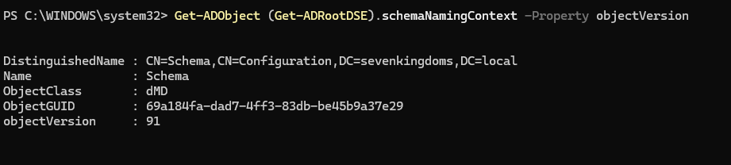
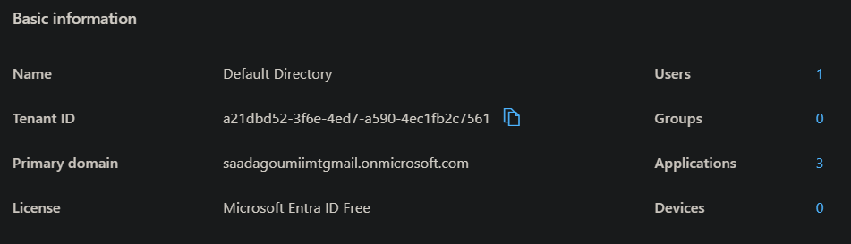
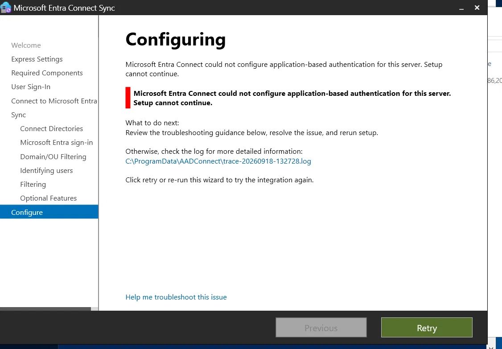
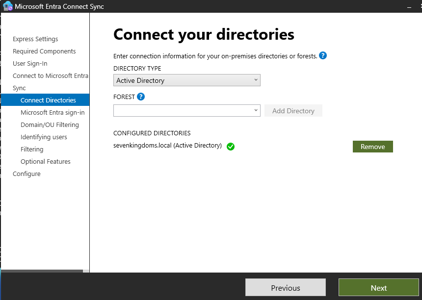

# Infrastructure — Lab GOAD-Light + Entra ID (Module 1)

> Documente comment ce lab est construit, de zéro. Reproductible à partir de ce fichier.

---

## 1. Architecture

```
                         ┌───────────────────────────────────────────┐
                         │        Tenant Microsoft Entra ID           │
                         │        saadagoumiimtgmail.onmicrosoft.com  │
                         │        Tenant ID : a21dbd52-3f6e-4ed7-...  │
                         │        Licence : Microsoft Entra ID Free   │
                         │        Admin : admin@saadagoumiimtgmail... │
                         └───────────────────┬─────────────────────┘
                                             │
                              (synchronisation — voir §6, NON FONCTIONNELLE)
                                             │
        ┌────────────────────────────────────┴────────────────────────────────────┐
        │                     Forêt AD  sevenkingdoms.local                        │
        │                                                                          │
        │   ┌─────────────────────┐        ┌──────────────────────────┐           │
        │   │  DC01 (KINGSLANDING) │        │  DC03                    │           │
        │   │  sevenkingdoms.local │◄──────►│  sevenkingdoms.local     │           │
        │   │  192.168.56.10       │        │  192.168.56.30           │           │
        │   │  Windows Server 2019 │        │  Windows Server 2025     │           │
        │   │  DC racine            │        │  Schéma upgradé 88→91   │           │
        │   └──────────┬───────────┘        │  (dMSA / BadSuccessor,  │           │
        │              │ trust forêt         │   volontairement non    │           │
        │              │ bidirectionnel      │   patché)               │           │
        │              │                     └──────────────────────────┘           │
        │   ┌──────────▼───────────┐        ┌──────────────────────────┐           │
        │   │  DC02 (WINTERFELL)    │        │  SRV02 (CASTELBLACK)     │           │
        │   │  north.sevenkingdoms  │◄──────►│  Membre du domaine NORTH │           │
        │   │  .local (domaine enfant)│      │  192.168.56.22           │           │
        │   │  192.168.56.11        │        │  Windows Server 2019     │           │
        │   │  Windows Server 2019  │        │  MSSQL                  │           │
        │   └───────────────────────┘        └──────────────────────────┘           │
        │                                                                          │
        │   ┌───────────────────────────────────────────────────┐                 │
        │   │  CONNECTOR (hors GOAD, montée manuellement)         │                 │
        │   │  Membre de sevenkingdoms.local                      │                 │
        │   │  192.168.56.23 (+ carte NAT secondaire, Internet)   │                 │
        │   │  Windows Server 2022                                 │                 │
        │   │  Dédiée aux tentatives Microsoft Entra Connect      │                 │
        │   └───────────────────────────────────────────────────┘                 │
        └──────────────────────────────────────────────────────────────────────────┘

Réseau VMware : VMnet2, host-only, 192.168.56.0/24, DHCP désactivé.
```

---

## 2. Infrastructure — tableau des VMs

| VM | Rôle | OS | Ressources | Réseau |
|---|---|---|---|---|
| DC01 (KINGSLANDING) | DC racine `sevenkingdoms.local` | Windows Server 2019 | Déployée par GOAD-Light (Vagrant) | VMnet2, `192.168.56.10` |
| DC02 (WINTERFELL) | DC du domaine enfant `north.sevenkingdoms.local` | Windows Server 2019 | Déployée par GOAD-Light (Vagrant) | VMnet2, `192.168.56.11` |
| SRV02 (CASTELBLACK) | Serveur membre de NORTH, MSSQL | Windows Server 2019 | Déployée par GOAD-Light (Vagrant) | VMnet2, `192.168.56.22` |
| DC03 | DC additionnel de `sevenkingdoms.local`, schéma upgradé 88→91 (dMSA/BadSuccessor) | Windows Server 2025 | Ajoutée manuellement à la forêt GOAD-Light | VMnet2, `192.168.56.30` |
| **CONNECTOR** | Serveur membre dédié aux tentatives Entra Connect | Windows Server 2022 | 4 vCPU / 4 Go RAM / 60 Go disque | 2 cartes : VMnet2 `192.168.56.23` (interne) + NAT (Internet) |

**Hyperviseur :** VMware Workstation Pro **17.6.3** précisément — les versions plus récentes ne sont pas compatibles avec l'outillage Vagrant utilisé pour déployer GOAD-Light.

---

## 3. Étapes de construction

### 3.1 Choix d'architecture et pourquoi

- **GOAD-Light plutôt que GOAD complet** : GOAD complet déploie une dizaine de machines sur trois forêts ; GOAD-Light se limite à 2 domaines / 3 machines, largement suffisant pour couvrir les modules d'attaque prévus, et beaucoup plus léger pour un hôte à 4 cœurs / 34 Go de RAM qui doit aussi faire tourner CONNECTOR et le SIEM.
- **VMware Workstation plutôt que VirtualBox** : VirtualBox a été désinstallé avant de commencer, pour éviter les conflits réseau entre les deux hyperviseurs (adaptateurs virtuels qui se chevauchent).
- **Vagrant piloté depuis Windows, pas depuis WSL2** : le plugin `vagrant-vmware-desktop` et le Vagrant VMware Utility s'installent côté Windows ; seul le reste du provisioning (scripts, Ansible) tourne dans WSL2.

### 3.2 Préparer l'hyperviseur

```powershell
vagrant plugin install vagrant-vmware-desktop
```

Installer le **Vagrant VMware Utility** (MSI séparé, téléchargé sur le site HashiCorp), puis vérifier que le service tourne :

```powershell
Get-Service VagrantVMware
```

### 3.3 Configurer le réseau VMware

Dans le "Virtual Network Editor" de VMware : réseau `VMnet2` en mode **Host-only**, sous-réseau `192.168.56.0/24`, **DHCP désactivé**.

VMware, contrairement à VirtualBox, n'assigne pas automatiquement d'IP côté hôte à l'adaptateur `VMnet2` — assignation manuelle nécessaire :

```powershell
New-NetIPAddress -InterfaceIndex <index_VMnet2> -IPAddress 192.168.56.1 -PrefixLength 24
```

### 3.4 Cloner GOAD et configurer le lab

Depuis WSL2 :

```bash
./goad.sh
set_lab GOAD-Light
set_provider vmware
check
```

`check` valide tous les prérequis (Vagrant, plugin, utility, réseau) avant de lancer quoi que ce soit.

### 3.5 Créer et démarrer les VMs

```bash
install
```

**Incident — VM non prête après le premier démarrage**

- **Symptôme :** une VM échoue avec `not ready for guest communication` au tout premier démarrage.
- **Diagnostic :** bug connu de l'intégration Vagrant/VMware sur Windows, pas une erreur de configuration.
- **Correctif :** relancer le provisioning de cette VM précisément :
```bash
vagrant.exe provision <nom-de-la-vm>
```

### 3.6 Vérifier la connectivité réseau

```powershell
Test-NetConnection -ComputerName 192.168.56.X -Port 5986
```
```bash
nc -zv 192.168.56.X 5986
```

### 3.7 Provisioning Ansible

```bash
provision_lab
```

**Incident — `servers.yml` bloqué sans erreur**

- **Symptôme :** le playbook reste bloqué indéfiniment sur l'installation de SQL Server Express / SSMS, sans message d'erreur.
- **Diagnostic :** une fenêtre d'installation graphique invisible (côté VM, pas visible depuis Ansible) attend une validation manuelle.
- **Correctif :** se connecter directement à la console VMware de la VM concernée, tuer le processus d'installation bloqué, puis relancer l'installeur **en mode interactif** (double-clic, pas en ligne de commande) pour valider les écrans à la main.

**Incident — boucle infinie sur l'installation de SSMS**

- **Symptôme :** malgré une installation manuelle réussie de SSMS, le playbook reboucle indéfiniment dessus.
- **Diagnostic :** le check du playbook cherche un dossier que cette version de SSMS ne crée plus au même endroit.
- **Correctif :** créer manuellement le dossier attendu pour satisfaire le check :
```powershell
New-Item -Path "C:\Program Files (x86)\Microsoft SQL Server Management Studio 18" -ItemType Directory -Force
```

Puis reprendre :
```bash
provision servers.yml
provision security.yml
provision vulnerabilities.yml
```

Les trois playbooks se terminent avec `failed=0` sur DC01, DC02 et SRV02.

### 3.8 Snapshot initial

Depuis la console GOAD :
```bash
snapshot
```

### 3.9 Ajout de DC03 (Windows Server 2025, schéma dMSA)

Un quatrième DC est ajouté manuellement à la forêt `sevenkingdoms.local`, sur Windows Server 2025, pour disposer d'un schéma AD supportant les comptes `dMSA` (`msDS-DelegatedManagedServiceAccount`) nécessaires au module BadSuccessor. Le schéma est volontairement laissé **non patché** (aucune mise à jour post-CVE-2025-53779), pour permettre de reproduire l'attaque avant d'en démontrer le correctif dans le writeup dédié.

L'ajout se fait par promotion classique en DC additionnel de la forêt existante (`Install-ADDSDomainController`), ce qui déclenche automatiquement l'extension du schéma vers la version portée par Server 2025 (version 91). Vérification :

```powershell
Get-ADObject (Get-ADRootDSE).schemaNamingContext -Property objectVersion
```



Snapshot pris une fois DC03 stable et intégré.

### 3.10 Création du tenant Microsoft Entra ID

Le tenant est créé via l'offre d'**essai Azure individuel** (pas de Microsoft 365 Developer Program — non disponible pour un compte individuel). Compte administrateur `admin@saadagoumiimtgmail.onmicrosoft.com`, rôle **Global Administrator**, licence **Microsoft Entra ID Free** (permanente, sans limite de 30 jours pour la gestion d'identités).



---

## 4. Microsoft Entra Connect — synchronisation on-prem ↔ cloud

C'est l'étape qui a concentré le plus d'incidents de tout le Module 1. Elle reste **non résolue** à ce jour (voir §6 pour l'état exact et l'impact sur la suite du projet).

### 4.1 Tentative n°1 — Entra Connect Sync classique sur SRV02

Installation Custom (LocalDB, Password Hash Sync, forêt `sevenkingdoms.local`). L'assistant progresse jusqu'à l'étape finale "Configuring", puis échoue.

**Incident — `AADSTS700016`**

- **Symptôme :**
```
AADSTS700016: Application with identifier '...' was not found in the directory
'9cd80435-793b-4f48-844b-6b3f37d1c1f3'. [...] You may have sent your
authentication request to the wrong tenant.
```
Le tenant référencé dans l'erreur (`9cd80435-...`) ne correspond à aucun tenant connu — ni le nôtre, ni un tenant "fantôme" qu'on aurait pu créer par erreur.
- **Diagnostic :** l'étape d'**authentification par application (ABA — Application-Based Authentication)**, qui enregistre dynamiquement une application Entra ID pendant l'installation, échoue systématiquement à ce moment précis.
- **Cause :** un fil de support Microsoft officiel documente exactement le même symptôme, sur **Windows Server 2019 et 2025**, sans correctif confirmé à la date de rédaction. Ce n'est donc pas une erreur de configuration de notre côté — c'est un bug reproductible de la version 2.6.91.0 de Microsoft Entra Connect Sync.



### 4.2 Tentative de correctif agressif — casse le service ADSync

En tentant de nettoyer un éventuel cache de jeton corrompu (hypothèse initiale pour expliquer le tenant fantôme), le profil de service `C:\Windows\ServiceProfiles\ADSync` est supprimé de force (`takeown` + `icacls` + `rmdir`).

**Incident — le service ADSync ne redémarre plus**

- **Symptôme :** `Add-KdsRootKey`/démarrage du service ADSync échoue avec :
```
CKeySet::PersistCredVaultKey failed to save the encryption key [...]
in the Windows Credential Vault: 0x80070520
(A specified logon session does not exist.)
```
- **Diagnostic :** la clé de registre `ProfileList` correspondant au SID du compte `NT SERVICE\ADSync` a été renommée en `.bak` par Windows — signe classique d'un profil détecté comme corrompu.
- **Cause racine :** la suppression brutale du dossier de profil a cassé la capacité du compte de service virtuel à ouvrir une session valide pour le Windows Credential Vault, un mécanisme totalement indépendant du bug ABA d'origine.
- **Tentative de correctif :** suppression de la clé `.bak`, recréation du profil, activation du service `VaultSvc` (Credential Manager, trouvé arrêté) — sans succès, l'erreur persiste identique même avec un profil neuf.
- **Résolution finale :** restauration du snapshot de SRV02 pris avant cette manipulation. **Leçon retenue :** ne plus toucher au profil du compte de service pour corriger le bug ABA — les deux problèmes sont indépendants.

### 4.3 Tentative n°2 — Cloud Sync sur SRV02 (contournement de l'ABA)

Cloud Sync utilise un agent léger avec un compte de service **gMSA**, sans mécanisme ABA — piste retenue pour contourner le bug `AADSTS700016`.

**Incident — crash du service à chaque démarrage**

- **Symptôme :**
```
Exception Info: System.Exception
   at Windows.Security.Credentials.PasswordVault.RetrieveAll()
```
- **Diagnostic :** même sous-système Credential Vault que l'incident précédent, cette fois avec le compte gMSA de Cloud Sync.
- **Cause probable :** état résiduel corrompu sur cette VM précise (SRV02), conséquence indirecte de la manipulation du §4.2.
- **Décision :** abandonner SRV02 pour cette tentative, basculer sur DC03 (jamais manipulé de cette façon).

### 4.4 Tentative n°3 — Cloud Sync sur DC03

**Incident — création du gMSA impossible (clé KDS)**

- **Symptôme :** `Add-KdsRootKey -EffectiveImmediately` échoue avec `The request is not supported. (0x80070032)`.
- **Diagnostic :** la commande était exécutée avec un compte administrateur local, pas Enterprise Admin.
- **Correctif :** relancer en tant que `SEVENKINGDOMS\administrator` (Enterprise Admin de la forêt) :
```powershell
Add-KdsRootKey -EffectiveImmediately
```
- **Incident secondaire :** même après création réussie, la création du gMSA échouait encore, la propagation de la clé KDS n'étant pas immédiate malgré le paramètre. Contournement : créer une deuxième clé **antidatée** de 10 heures pour la rendre utilisable sans délai d'attente :
```powershell
Add-KdsRootKey -EffectiveTime ((Get-Date).AddHours(-10))
```

Vérification (les deux clés créées sont toujours présentes sur DC03) :
```powershell
Get-KdsRootKey
```


Le gMSA se crée alors normalement, les permissions AD sont accordées — mais l'inscription finale de l'agent échoue :

**Incident — licence incompatible**

- **Symptôme :**
```
ConnectorRegistration failed: Your username and password must exist in the
Azure AD directory you are attempting to access.
```
- **Diagnostic :** message trompeur — l'authentification interactive avait pourtant réussi juste avant (rôle Global Admin confirmé).
- **Cause racine :** **Microsoft Entra Cloud Sync nécessite une licence Microsoft Entra ID P1**, incompatible avec la licence **Free** du tenant.

**Tentative d'obtention d'un essai P1** — infructueuse : le tenant, créé via l'essai Azure individuel, n'a pas de "présence commerciale" et ne permet ni l'achat ni l'essai de licences (confirmé à la fois via le portail Azure et via le centre d'administration Microsoft 365, qui répond tous deux par un blocage d'accès).

### 4.5 Tentative n°4 — retour à Entra Connect Sync classique sur DC03

Même bug `AADSTS700016` reproduit à l'identique sur Windows Server 2025.

**Tentative d'application du correctif officiel Microsoft** (`Add-ADSyncAADServiceAccount`, qui repasse en mode d'authentification "legacy" au lieu d'ABA) — échoue avec `Operation failed because the specified Connector could not be found`. Vérification :
```powershell
Get-ADSyncConnector | Select-Object Name, ConnectorTypeName, Identifier
```
retourne une liste **vide**. **Diagnostic :** ce correctif officiel ne s'applique qu'à un connecteur déjà enregistré qui perd son inscription plus tard — pas à un tout premier échec d'installation, où le connecteur Entra ID n'a en réalité jamais persisté.

### 4.6 Tentative n°5 — nouvelle VM Windows Server 2022 (CONNECTOR)

Un fil de support Microsoft mentionnait Windows Server 2022 comme dernier recours n'ayant pas (encore) montré le même bug. Une VM dédiée est montée **manuellement, hors GOAD/Vagrant** — une seule VM ponctuelle ne justifie pas d'industrialiser son provisioning.

**Incident — installation Windows échoue au tout début**

- **Symptôme :** `Windows cannot find the Microsoft Software License Terms. Make sure the installation sources are valid and restart the installation.`
- **Diagnostic :** le fichier de réponse automatique (`autoinst.flp`, généré par la fonction "Easy Install" de VMware) était mal formé pour cette édition.
- **Correctif :** supprimer le périphérique **Floppy** des paramètres matériels de la VM, refaire une installation Windows **entièrement manuelle** (sélection explicite du lecteur CD/DVD dans le Boot Manager UEFI — en pressant une touche rapidement pendant le court message `Press any key to boot from CD or DVD......`, dont le délai très court avait fait échouer les deux premières tentatives de démarrage).

CONNECTOR est ensuite configurée en IP statique (`192.168.56.23`, DNS `192.168.56.10`) et jointe au domaine `sevenkingdoms.local` comme serveur membre.

```powershell
New-NetIPAddress -InterfaceAlias "Ethernet0" -IPAddress 192.168.56.23 -PrefixLength 24 -DefaultGateway 192.168.56.1
Set-DnsClientServerAddress -InterfaceAlias "Ethernet0" -ServerAddresses 192.168.56.10
Add-Computer -DomainName "sevenkingdoms.local" -Credential (Get-Credential) -Restart
```


**Incident — aucune connectivité Internet sortante**

- **Symptôme :** l'assistant Entra Connect reste bloqué indéfiniment sur l'écran de connexion Microsoft ; `Test-NetConnection` vers `login.microsoftonline.com:443` échoue sur toutes les IP résolues, en IPv4 comme en IPv6.
- **Diagnostic :** contrairement à SRV02 (qui a deux cartes réseau — une sur VMnet2, une en NAT pour Internet), CONNECTOR n'avait qu'une seule carte, sur VMnet2 — un réseau host-only sans route vers Internet.
- **Correctif :** ajout d'une deuxième carte réseau en mode **NAT** dans les paramètres VMware de la VM. Confirmation :
```powershell
Invoke-WebRequest -Uri "https://login.microsoftonline.com" -UseBasicParsing | Select-Object StatusCode
# StatusCode : 200
```

**Incident — erreur `0xCAA80000` du composant WAM (Web Account Manager)**

- **Symptôme :** `We can't connect you. [...] 0xCAA80000 / login.microsoftonline.com`, malgré une connectivité HTTPS de base fonctionnelle.
- **Diagnostic :** vérification de l'horloge système :
```powershell
w32tm /query /status
# Leap Indicator: 3 (not synchronized)
# Source: Local CMOS Clock
```
- **Cause :** l'horloge de la VM n'avait jamais été synchronisée avec le domaine et avait dérivé — un décalage, même faible, casse la validation des jetons OAuth/TLS.
- **Correctif :**
```powershell
w32tm /config /manualpeerlist:"192.168.56.10" /syncfromflags:manual /reliable:no /update
Restart-Service w32time
w32tm /resync /force
```
Après correction (`Leap Indicator: 0 (no warning)`), la connexion Microsoft aboutit pour la première fois.




- **Point non résolu :** l'erreur `0xCAA80000` a fini par **réapparaître de façon intermittente** sur des tentatives suivantes, malgré une horloge toujours correctement synchronisée. Pistes explorées sans succès définitif : forçage de TLS 1.2 via le registre (.NET Framework, `SchUseStrongCrypto` / `SystemDefaultTlsVersions`), nettoyage du cache de jetons WAM. Mises à jour cumulatives Windows lancées mais interrompues faute de temps (une mise à jour affichait une taille anormale de 26 Go, probablement un artefact d'affichage du module `PSWindowsUpdate`, non investigué).

---

## 5. État actuel / prochaines étapes

- ✅ Lab GOAD-Light (DC01, DC02, SRV02) opérationnel, snapshot pris.
- ✅ DC03 (Server 2025, schéma 91) intégré à la forêt, non patché intentionnellement.
- ✅ Tenant Microsoft Entra ID créé et configuré.
- ❌ **Synchronisation Entra ID (Connect Sync et Cloud Sync) non fonctionnelle**, après 5 tentatives distinctes couvrant Server 2019, 2025 et 2022. Mise en pause — voir §4 pour le détail de chaque blocage.
- ⬜ Reprise envisagée si un correctif Microsoft pour `AADSTS700016` sort, ou si une licence P1 devient accessible (ex. via un essai Microsoft 365 Business, qui débloquerait une vraie présence commerciale sur le tenant).

**Impact sur la suite du projet :**
- **Module BadSuccessor (dMSA)** : **non affecté**, n'a aucune dépendance à la synchronisation cloud. Réalisable dès maintenant sur DC03.
- **Module Entra ID hybride / DCSync via compte de synchronisation** : **bloqué** tant que la synchronisation n'est pas résolue.
- **Modules SIEM, recon, ADCS, Kerberos** : non affectés.
