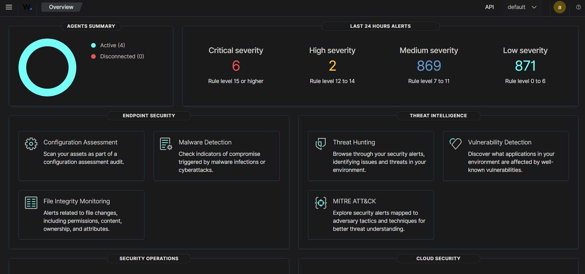
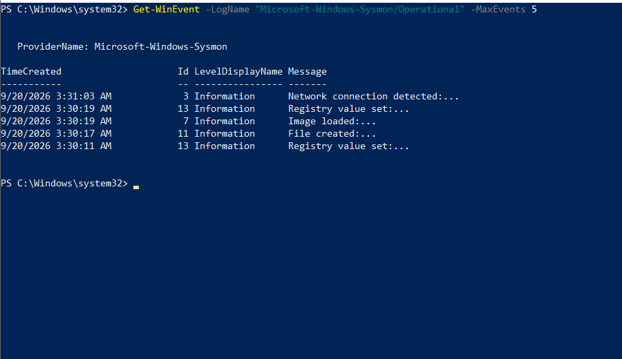
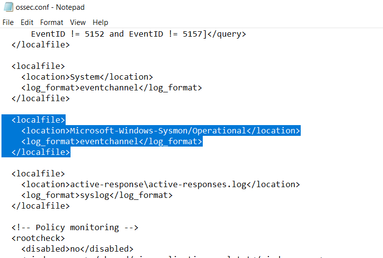
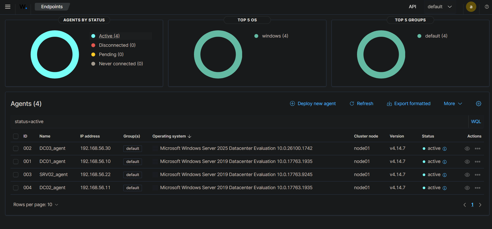
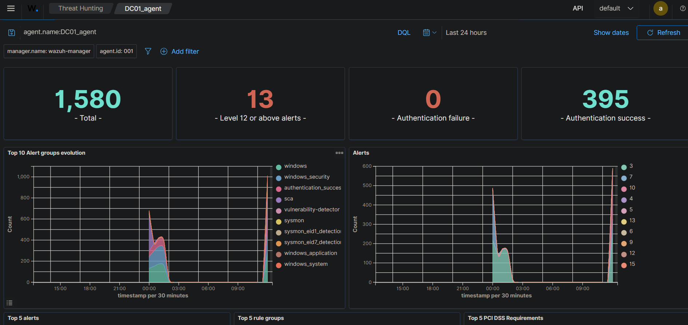
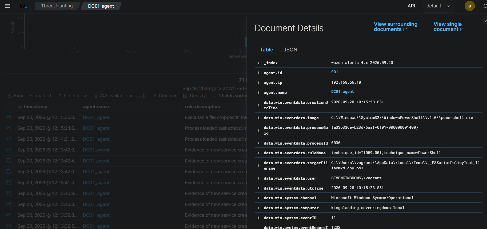

# SIEM — Déploiement Wazuh + Sysmon (Module 2)

> Documente comment le SIEM est déployé et connecté au lab. Reproductible de zéro à partir de ce fichier.

---

## 1. Architecture

```
DC01 (kingslanding, 192.168.56.10)   ─┐
DC02 (winterfell, 192.168.56.11)     ─┤
SRV02 (castelblack, 192.168.56.22)   ─┤  Sysmon (config Olaf Hartong — sysmon-modular)
DC03 (192.168.56.30)                 ─┘  + agent Wazuh (WazuhSvc), lit le canal
                                          Microsoft-Windows-Sysmon/Operational
                                          + Application / Security / System (eventchannel)
        │
        ▼
wazuh-manager (VM Ubuntu dédiée, 192.168.56.40)
  ├── wazuh-indexer   (stockage des événements)
  ├── wazuh-manager   (règles + moteur d'alerte)
  └── wazuh-dashboard (interface web, port 443)
```

Le manager est **hors GOAD-Light**, sur son propre segment (même réseau VMnet2 que les DC, mais VM indépendante) — pas de dépendance Docker/WSL2, pour éviter les problèmes réseau déjà rencontrés avec la VM CONNECTOR (Entra Connect).

**Les 4 machines du lab sont toutes instrumentées** : validation initiale sur DC01 seul, puis extension à DC02, SRV02 et DC03 une fois la chaîne confirmée fonctionnelle — plutôt que d'attendre un besoin module par module, les modules suivants touchant plusieurs machines à la fois (et DC03 en ayant de toute façon besoin pour le module BadSuccessor).

---

## 2. VM `wazuh-manager` — infrastructure

| | |
|---|---|
| **Nom de la VM** | `wazuh-manager` |
| **OS** | Ubuntu Server 22.04.5 LTS (installation manuelle, ISO officielle) |
| **Ressources** | 2 vCPU / 4 Go RAM / 50 Go disque (réduit du minimum officiel Wazuh — 4 vCPU/8 Go — faute de ressources CPU disponibles sur l'hôte) |
| **Hyperviseur** | VMware Workstation Pro 17.6.3 |
| **Réseau** | 2 cartes : `ens33` en NAT/DHCP (accès Internet, temporaire pour l'installation) ; `ens34` en Custom VMnet2, IP statique **`192.168.56.40/24`** — même réseau que GOAD-Light (DC01-04, SRV02) |
| **SSH** | OpenSSH server installé pendant l'installation Ubuntu, accès mot de passe activé |

**Partitionnement** : disque entier en LVM, un seul volume logique `/` étendu à la totalité de l'espace disponible (47,996 Go) plutôt que la répartition par défaut de l'installeur (qui ne réserve que ~50 %), pour laisser toute la marge à l'indexer.

### Comment s'y connecter

**Via SSH** (depuis WSL2 ou tout terminal ayant une route vers `192.168.56.0/24`) :
```bash
ssh saad@192.168.56.40
```

**Via le dashboard web** (depuis un navigateur sur la machine hôte Windows) :
```
https://192.168.56.40
```
Un avertissement de certificat auto-signé apparaît — c'est normal, propre au lab. Cliquer sur "Avancé" / "Continuer quand même", puis se connecter avec l'utilisateur `admin` (voir §3 pour le mot de passe).

---

## 3. Installation de Wazuh (all-in-one)

Sur la VM, une fois le réseau et SSH opérationnels :

```bash
curl -sO https://packages.wazuh.com/4.14/wazuh-install.sh
sudo bash ./wazuh-install.sh -a
```

`-a` installe les trois composants (indexer, manager, dashboard) sur la même machine. Le script a fonctionné sans avoir besoin du flag `-i` (ignorer les prérequis matériels), malgré les ressources réduites — installation complète en ~23 minutes.

**Sortie clé à la fin de l'installation :**
```
You can access the web interface https://192.168.56.40:443
    User: admin
    Password: <généré automatiquement par le script>
```

> **Sécurité / bonnes pratiques repo public :** le mot de passe généré n'est **jamais commité dans ce dépôt**. Il est stocké localement sur la VM dans `wazuh-install-files.tar` (répertoire `/home/saad`), consultable avec `tar -tvf wazuh-install-files.tar | grep passwords`. Pour reproduire l'installation, relance simplement `wazuh-install.sh -a`, qui génère un nouveau mot de passe à chaque exécution. Le mot de passe du compte système `saad` (utilisé pour SSH) n'est pas non plus documenté ici pour la même raison.

**Persistance** : les trois services (`wazuh-indexer`, `wazuh-manager`, `wazuh-dashboard`) sont activés (`enabled`) au démarrage — aucune commande à relancer après un redémarrage de la VM.

**Vérification** — vue d'ensemble du dashboard, les 4 agents actifs :



---

## 4. Déploiement de l'agent Wazuh + Sysmon — procédure commune

La même procédure a été appliquée sur **DC01, DC02, SRV02 et DC03**, dans cet ordre (DC01 pour valider la chaîne complète en premier, puis généralisation).

### 4.1 Enregistrer l'agent depuis le dashboard

`Endpoints → Deploy new agent` :
- Package : **MSI 32/64 bits**
- Server address : `192.168.56.40`
- Agent name : `DC01_agent` (puis `DC02_agent`, `SRV02_agent`, `DC03_agent`)
- Groupe : `Default`

### 4.2 Installer le VC++ Redistributable (préventif)

```powershell
Invoke-WebRequest -Uri https://aka.ms/vs/17/release/vc_redist.x64.exe -OutFile $env:tmp\vc_redist.x64.exe
Start-Process -FilePath $env:tmp\vc_redist.x64.exe -ArgumentList "/install", "/quiet", "/norestart" -Wait
```

#### Incident rencontré (sur DC01, corrigé en préventif sur les suivantes)

Le service `WazuhSvc` refusait de démarrer (`System error 1067`) faute de ce Redistributable. Diagnostic via le journal d'événements Windows :
```
Faulting application name: wazuh-agent.exe
Faulting module name: KERNELBASE.dll
Exception code: 0xc06d007e
```
**Cause :** dépendances manquantes (`libwazuhext.dll`, `libstdc++-6.dll`) sur ces images Windows Server 2019/2025. En installant le Redistributable **avant** l'agent sur DC02/SRV02/DC03, l'incident ne s'est pas reproduit.

### 4.3 Installer et démarrer l'agent Wazuh

```powershell
Invoke-WebRequest -Uri https://packages.wazuh.com/4.x/windows/wazuh-agent-4.14.7-1.msi -OutFile $env:tmp\wazuh-agent
msiexec.exe /i $env:tmp\wazuh-agent /q WAZUH_MANAGER='192.168.56.40' WAZUH_AGENT_NAME='DC01_agent'
NET START Wazuh
```
Vérification :
```powershell
Get-Service Wazuh
```

### 4.4 Installer Sysmon avec la config Olaf Hartong

```powershell
Invoke-WebRequest -Uri "https://download.sysinternals.com/files/Sysmon.zip" -OutFile "$env:tmp\Sysmon.zip"
Expand-Archive -Path "$env:tmp\Sysmon.zip" -DestinationPath "$env:tmp\Sysmon" -Force

Invoke-WebRequest -Uri "https://github.com/olafhartong/sysmon-modular/releases/latest/download/sysmonconfig.xml" -OutFile "$env:tmp\sysmonconfig.xml"

& "$env:tmp\Sysmon\Sysmon64.exe" -accepteula -i "$env:tmp\sysmonconfig.xml"
```
> Note : le fichier `sysmonconfig.xml` n'est plus servi à la racine du dépôt GitHub olafhartong/sysmon-modular — il faut passer par l'URL de release (`/releases/latest/download/...`).

Vérification (chaque événement est annoté d'un `RuleName` avec l'ID MITRE ATT&CK correspondant) :
```powershell
Get-WinEvent -LogName "Microsoft-Windows-Sysmon/Operational" -MaxEvents 5
```



### 4.5 Faire lire le canal Sysmon par l'agent Wazuh

Par défaut, `ossec.conf` ne surveille pas le canal Sysmon. Ajout manuel d'un bloc `<localfile>`, entre les blocs existants `System` et `active-response` :

```powershell
notepad "C:\Program Files (x86)\ossec-agent\ossec.conf"
```
```xml
<localfile>
  <location>Microsoft-Windows-Sysmon/Operational</location>
  <log_format>eventchannel</log_format>
</localfile>
```



Puis redémarrage de l'agent :
```powershell
NET STOP Wazuh
NET START Wazuh
```

---

## 5. Cas particulier — DC03 (isolée du réseau, sans accès Internet)

DC03 est délibérément maintenue **hors ligne** (carte réseau uniquement sur VMnet2, aucune carte NAT) pour rester un DC Windows Server 2025 non patché, prérequis du module BadSuccessor — toute connexion Internet risquerait de déclencher Windows Update automatiquement (incident déjà rencontré et documenté dans `infra/README.md`).

Les 4.2 à 4.4 nécessitent donc un **transfert manuel des fichiers**, plutôt que les `Invoke-WebRequest` habituels :

1. Sur la machine hôte (ou WSL2), télécharger les 4 fichiers :
   - `vc_redist.x64.exe`
   - `wazuh-agent-4.14.7-1.msi`
   - `Sysmon.zip`
   - `sysmonconfig.xml`
2. Les transférer vers DC03 via le presse-papiers partagé VMware, un dossier partagé, ou glisser-déposer dans la fenêtre de la VM.
3. Adapter chaque commande pour pointer sur le fichier local plutôt que de le télécharger, par exemple :
   ```powershell
   Start-Process -FilePath "C:\Users\vagrant.SEVENKINGDOMS\Downloads\VC_redist.x64.exe" -ArgumentList "/install", "/quiet", "/norestart" -Wait
   msiexec.exe /i "C:\Users\vagrant.SEVENKINGDOMS\Downloads\wazuh-agent-4.14.7-1.msi" /q WAZUH_MANAGER='192.168.56.40' WAZUH_AGENT_NAME='DC03_agent'
   NET START Wazuh
   Expand-Archive -Path "C:\Users\vagrant.SEVENKINGDOMS\Downloads\Sysmon.zip" -DestinationPath "C:\Users\vagrant.SEVENKINGDOMS\Downloads\Sysmon" -Force
   & "C:\Users\vagrant.SEVENKINGDOMS\Downloads\Sysmon\Sysmon64.exe" -accepteula -i "C:\Users\vagrant.SEVENKINGDOMS\Downloads\sysmonconfig.xml"
   ```
4. Étape 4.5 (édition de `ossec.conf`) inchangée.

DC03_agent est actif et remonte des événements Sysmon, confirmé sans jamais avoir exposé la machine à Internet. Snapshot pris immédiatement après (`dc03-win2025-unpatched-1742-wazuh-sysmon-active`).

---

## 6. Vérification finale

Dans le dashboard Wazuh (**Endpoints**), les 4 agents apparaissent **Active** :



Dans **Threat Hunting → Events**, filtré sur un agent puis `rule.groups: sysmon` :



Détail d'une alerte Sysmon ouverte (`data.win.system.channel = Microsoft-Windows-Sysmon/Operational`, `data.win.eventdata.ruleName` contenant l'ID MITRE ATT&CK) :



La chaîne complète **Sysmon (Olaf Hartong) → agent Wazuh → manager → dashboard** est validée de bout en bout sur les 4 machines du lab.

---

## 7. État actuel / prochaines étapes

- ✅ Manager Wazuh opérationnel (all-in-one), démarrage automatique au boot.
- ✅ Agent + Sysmon opérationnels sur **DC01, DC02, SRV02 et DC03**, remontée confirmée dans le dashboard pour les 4.
- ✅ DC03 instrumentée sans jamais exposer la machine à Internet (transfert manuel des fichiers).
- ⬜ Règles de détection personnalisées (`local_rules.xml`) : pas encore nécessaires, seront écrites au fil des cas d'incident suivants (à partir du module 4 — ADCS) quand une technique n'a pas d'alerte par défaut dans le ruleset standard.

Snapshots VMware pris à chaque étape stable : `clean-ubuntu-22.04-pre-wazuh-install`, `wazuh-installed-working` (VM manager), `dc01-wazuh-agent-installed`, `dc03-win2025-unpatched-1742-wazuh-sysmon-active`.
