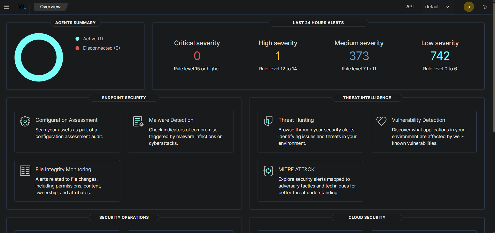
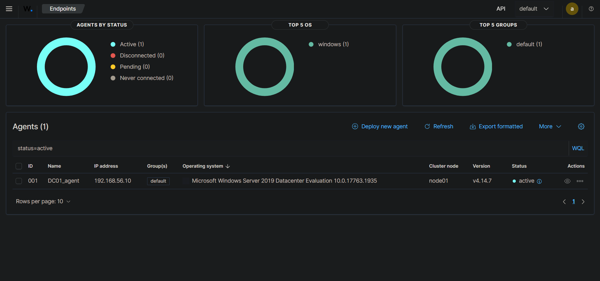

# SIEM — Déploiement Wazuh + Sysmon (Module 2)

> Documente comment le SIEM est déployé et connecté au lab. Reproductible de zéro à partir de ce fichier.

---

## 1. Architecture

```
DC01 (kingslanding, 192.168.56.10)
  Sysmon (config Olaf Hartong — sysmon-modular)
        │
        │ agent Wazuh (WazuhSvc), lit le canal Microsoft-Windows-Sysmon/Operational
        │ + Application / Security / System (eventchannel)
        ▼
wazuh-manager (VM Ubuntu dédiée, 192.168.56.40)
  ├── wazuh-indexer   (stockage des événements)
  ├── wazuh-manager   (règles + moteur d'alerte)
  └── wazuh-dashboard (interface web, port 443)
```

Le manager est **hors GOAD-Light**, sur son propre segment (même réseau VMnet2 que les DC, mais VM indépendante) — pas de dépendance Docker/WSL2, pour éviter les problèmes réseau déjà rencontrés avec la VM CONNECTOR (Entra Connect).

---

## 2. VM `wazuh-manager` — infrastructure

| | |
|---|---|
| **Nom de la VM** | `wazuh-manager` |
| **OS** | Ubuntu Server 22.04.5 LTS (installation manuelle, ISO officielle) |
| **Ressources** | 2 vCPU / 4 Go RAM / 50 Go disque (réduit du minimum officiel Wazuh — 4 vCPU/8 Go — faute de ressources CPU disponibles sur l'hôte) |
| **Hyperviseur** | VMware Workstation Pro 17.6.3 |
| **Réseau** | 2 cartes : `ens33` en NAT/DHCP (accès Internet, temporaire pour l'installation) ; `ens34` en Custom VMnet2, IP statique **`192.168.56.40/24`** — même réseau que GOAD-Light (DC01-04, SRV02) |
| **SSH** | OpenSSH server installé pendant l'installation Ubuntu, accès mot de passe activé |

**Partitionnement** : disque entier en LVM, un seul volume logique `/` étendu à la totalité de l'espace disponible (47,996 Go) plutôt que la répartition par défaut de l'installeur (qui ne réserve que ~50 %), pour laisser toute la marge à l'indexer.

### Comment s'y connecter

**Via SSH** (depuis WSL2 ou tout terminal ayant une route vers `192.168.56.0/24`) :
```bash
ssh saad@192.168.56.40
```

**Via le dashboard web** (depuis un navigateur sur la machine hôte Windows) :
```
https://192.168.56.40
```
Un avertissement de certificat auto-signé apparaît — c'est normal, propre au lab. Cliquer sur "Avancé" / "Continuer quand même", puis se connecter avec l'utilisateur `admin` (voir §3 pour le mot de passe).

---

## 3. Installation de Wazuh (all-in-one)

Sur la VM, une fois le réseau et SSH opérationnels :

```bash
curl -sO https://packages.wazuh.com/4.14/wazuh-install.sh
sudo bash ./wazuh-install.sh -a
```

`-a` installe les trois composants (indexer, manager, dashboard) sur la même machine. Le script a fonctionné sans avoir besoin du flag `-i` (ignorer les prérequis matériels), malgré les ressources réduites — installation complète en ~23 minutes.

**Sortie clé à la fin de l'installation :**
```
You can access the web interface https://192.168.56.40:443
    User: admin
    Password: <généré automatiquement par le script>
```

> **Sécurité / bonnes pratiques repo public :** le mot de passe généré n'est **jamais commité dans ce dépôt**. Il est stocké localement sur la VM dans `wazuh-install-files.tar` (répertoire `/home/saad`), consultable avec `tar -tvf wazuh-install-files.tar | grep passwords`. Pour reproduire l'installation, relance simplement `wazuh-install.sh -a`, qui génère un nouveau mot de passe à chaque exécution. Le mot de passe du compte système `saad` (utilisé pour SSH) n'est pas non plus documenté ici pour la même raison.

**Persistance** : les trois services (`wazuh-indexer`, `wazuh-manager`, `wazuh-dashboard`) sont activés (`enabled`) au démarrage — aucune commande à relancer après un redémarrage de la VM.

**Vérification** — vue d'ensemble du dashboard une fois l'agent DC01 enrôlé (voir §4) :



---

## 4. Déploiement de l'agent Wazuh sur DC01

Pour l'instant, l'agent est déployé **sur DC01 uniquement** — les autres machines du lab (DC02, DC03, SRV02) seront instrumentées seulement si un module d'attaque futur l'exige spécifiquement, plutôt que de généraliser le déploiement dès maintenant.

**Depuis le dashboard** (`Endpoints → Deploy new agent`) :
- Package : **MSI 32/64 bits**
- Server address : `192.168.56.40`
- Agent name : `DC01_agent`
- Groupe : `Default`

**Commandes générées et exécutées sur DC01 (PowerShell admin) :**
```powershell
Invoke-WebRequest -Uri https://packages.wazuh.com/4.x/windows/wazuh-agent-4.14.7-1.msi -OutFile $env:tmp\wazuh-agent
msiexec.exe /i $env:tmp\wazuh-agent /q WAZUH_MANAGER='192.168.56.40' WAZUH_AGENT_NAME='DC01_agent'
NET START Wazuh
```

### Incident rencontré et résolu

Le service `WazuhSvc` refusait de démarrer (`System error 1067`). Diagnostic via le journal d'événements Windows (`Get-WinEvent -LogName Application`) :

```
Faulting application name: wazuh-agent.exe
Faulting module name: KERNELBASE.dll
Exception code: 0xc06d007e
```

**Cause :** absence du Visual C++ Redistributable requis par les bibliothèques de l'agent (`libwazuhext.dll`, `libstdc++-6.dll`) sur cette image Windows Server 2019.

**Correctif :**
```powershell
Invoke-WebRequest -Uri https://aka.ms/vs/17/release/vc_redist.x64.exe -OutFile $env:tmp\vc_redist.x64.exe
Start-Process -FilePath $env:tmp\vc_redist.x64.exe -ArgumentList "/install", "/quiet", "/norestart" -Wait
NET START Wazuh
```

Après installation du Redistributable, le service démarre normalement. DC01_agent apparaît **Active** dans le dashboard, IP `192.168.56.10` correctement détectée, OS identifié automatiquement :



---

## 5. Installation de Sysmon + config Olaf Hartong sur DC01

**Choix de config** : Olaf Hartong (sysmon-modular) plutôt que SwiftOnSecurity — structurée par technique MITRE ATT&CK, orientée détection d'attaques AD (Kerberoasting, DCSync, création de comptes suspects), alignée avec les modules d'attaque du projet.

**Commandes (PowerShell admin, sur DC01) :**
```powershell
# Télécharger Sysmon (Sysinternals)
Invoke-WebRequest -Uri "https://download.sysinternals.com/files/Sysmon.zip" -OutFile "$env:tmp\Sysmon.zip"
Expand-Archive -Path "$env:tmp\Sysmon.zip" -DestinationPath "$env:tmp\Sysmon" -Force

# Télécharger la config Olaf Hartong (asset de release, pas le repo brut)
Invoke-WebRequest -Uri "https://github.com/olafhartong/sysmon-modular/releases/latest/download/sysmonconfig.xml" -OutFile "$env:tmp\sysmonconfig.xml"

# Installer Sysmon avec cette configuration
& "$env:tmp\Sysmon\Sysmon64.exe" -accepteula -i "$env:tmp\sysmonconfig.xml"
```

> Note : le fichier `sysmonconfig.xml` n'est plus servi à la racine du dépôt GitHub — il faut passer par l'URL de release (`/releases/latest/download/...`).

Résultat : profil "Balanced", schéma de config 4.91, service `Sysmon64` démarré. Vérification immédiate des événements côté DC01 :
```powershell
Get-WinEvent -LogName "Microsoft-Windows-Sysmon/Operational" -MaxEvents 5
```
Chaque événement est déjà annoté par un `RuleName` contenant l'ID MITRE ATT&CK correspondant (ex. `technique_id=T1574.010,technique_name=Services File Permissions Weakness`) :


---

## 6. Faire lire le canal Sysmon par l'agent Wazuh

Par défaut, `ossec.conf` ne surveille pas le canal Sysmon. Ajout manuel d'un bloc `<localfile>` dans `C:\Program Files (x86)\ossec-agent\ossec.conf`, entre les blocs existants `System` et `active-response` :

```xml
<localfile>
  <location>Microsoft-Windows-Sysmon/Operational</location>
  <log_format>eventchannel</log_format>
</localfile>
```


Puis redémarrage de l'agent :
```powershell
NET STOP Wazuh
NET START Wazuh
```

---

## 7. Vérification finale

Dans le dashboard Wazuh (**Threat Hunting → Events**, filtré sur `agent.name:DC01_agent` puis `rule.groups: sysmon`) :


Détail d'une alerte Sysmon ouverte (`data.win.system.channel = Microsoft-Windows-Sysmon/Operational`, `data.win.eventdata.ruleName` contenant l'ID MITRE ATT&CK) :


La chaîne complète **Sysmon (Olaf Hartong) → agent Wazuh → manager → dashboard** est validée de bout en bout sur DC01.

---

## 8. État actuel / prochaines étapes

- ✅ Manager Wazuh opérationnel (all-in-one), démarrage automatique au boot.
- ✅ Agent + Sysmon opérationnels sur DC01, remontée confirmée dans le dashboard.
- ⬜ DC02, DC03, SRV02 : pas encore instrumentés — à faire seulement si un module d'attaque futur le nécessite sur ces machines spécifiquement.
- ⬜ Règles de détection personnalisées (`local_rules.xml`) : pas encore nécessaires, seront écrites au fil des modules d'attaque (à partir du Module 4 — ADCS) quand une technique n'a pas d'alerte par défaut dans le ruleset standard.

Snapshots VMware pris à chaque étape stable : `clean-ubuntu-22.04-pre-wazuh-install`, `wazuh-installed-working` (VM manager), `dc01-wazuh-agent-installed` (avant ajout de Sysmon).
